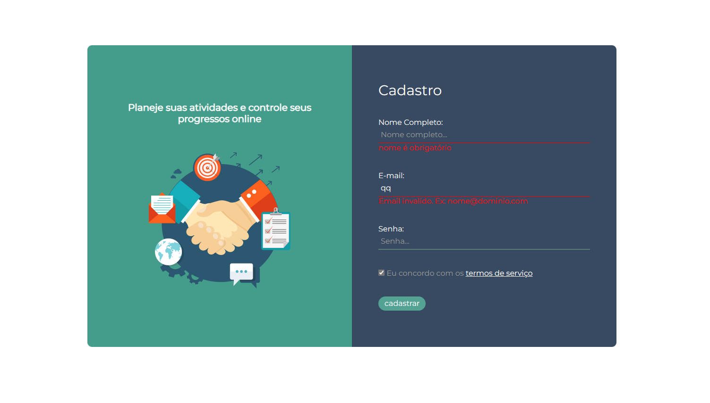
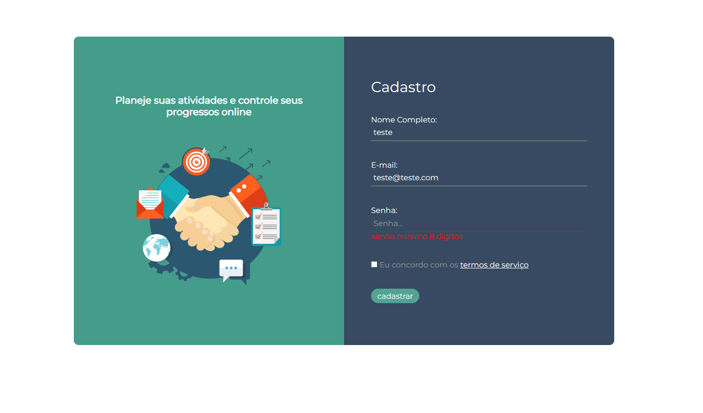
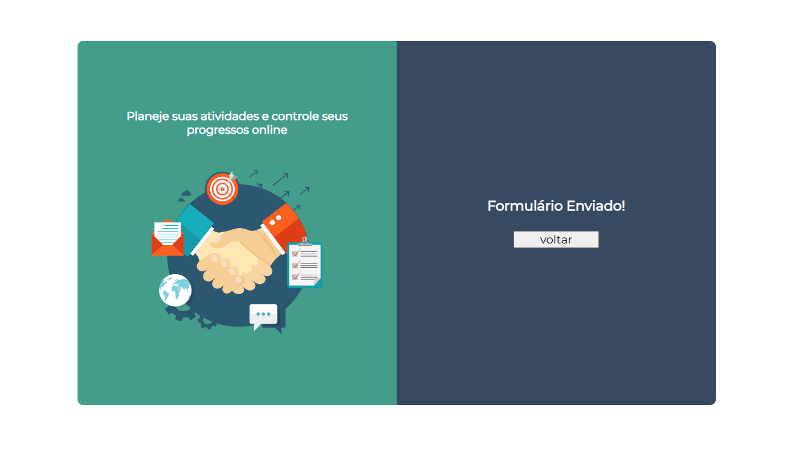

<h1 align="center"> Projeto Validação de Formulário</h1>

 

  <a href="#-sobre">Sobre</a>&nbsp;&nbsp;&nbsp;|&nbsp;&nbsp;&nbsp;
  <a href="#-projeto">Projeto</a>&nbsp;&nbsp;&nbsp;|&nbsp;&nbsp;&nbsp;
  <a href="#-tecnologias">Tecnologias</a>&nbsp;&nbsp;|&nbsp;&nbsp;&nbsp;&nbsp;
  <a href="#-Serviços">Serviços</a>&nbsp;&nbsp;&nbsp;|&nbsp;&nbsp;&nbsp;
  <a href="#-Autor">Autor</a>&nbsp;&nbsp;&nbsp;&nbsp;&nbsp;&nbsp;

 

## 🎯 Sobre

Esse prejeto foi desenvolvido com o seguinte objetivo, validar o formulário utilizando JavaScript

 

## 📷 Projeto

Validação de formulário

 

 

## 🚀 Tecnologias

Esse projeto foi desenvolvido com as seguintes tecnologias:

- HTML e CSS
- JavaScript
- Git e GitHub

 

## 📍 site

- aqui voce poderá ver o site completo: <a href="https://matheus-ellenberger.github.io/Desafio-1/">Clique aqui.</a> 
 

## 🛠️ Serviços

- <a href="https://github.com/Matheus-Ellenberger">GitHub</a> - Hospedagem
- <a href="https://fonts.google.com/">Google Fonts</a> - Fontes

 

## 🙋‍♂️ Autor

- Feito por Matheus Ellenberger <a href="https://github.com/Matheus-Ellenberger">GitHub</a>
